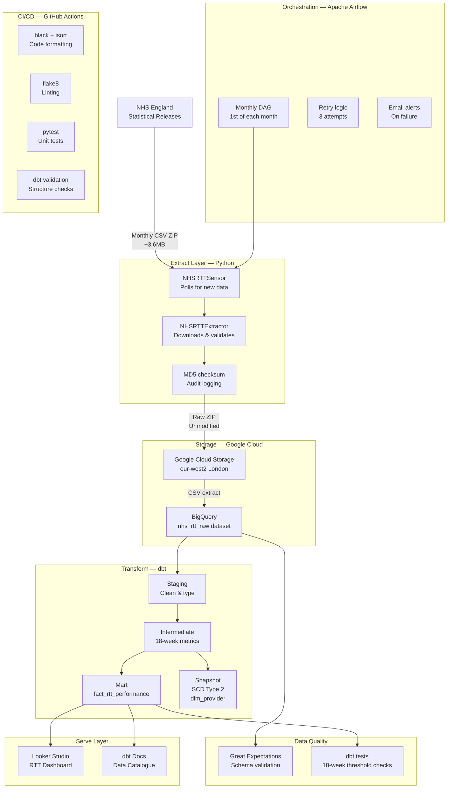

# NHS RTT & CWT Pipeline — Architecture

## System Architecture

## Data Flow

| Stage     | Tool                  | Input            | Output           |
| --------- | --------------------- | ---------------- | ---------------- |
| Schedule  | Airflow               | Calendar trigger | DAG run          |
| Sense     | Custom sensor         | NHS England page | Download signal  |
| Extract   | Python + requests     | NHS England URL  | Raw ZIP file     |
| Validate  | Great Expectations    | Raw CSV          | Pass/fail report |
| Load GCS  | google-cloud-storage  | Local ZIP        | GCS object       |
| Load BQ   | google-cloud-bigquery | GCS object       | Raw BQ table     |
| Stage     | dbt                   | Raw BQ table     | Typed view       |
| Transform | dbt                   | Staged view      | Metrics table    |
| Model     | dbt                   | Metrics table    | Fact table       |
| Snapshot  | dbt                   | Staged view      | SCD Type 2 table |
| Test      | dbt test              | All models       | Test results     |
| Serve     | Looker Studio         | Fact table       | Dashboard        |

## Key Design Decisions

### ELT over ETL

Raw data lands in BigQuery unmodified before any transformation.
This preserves the audit trail and allows reprocessing if
transformation logic changes.

### UK Data Residency

All GCP resources use `europe-west2` (London) to meet NHS
information governance requirements.

### Idempotent loads

Each pipeline run can be re-executed safely without creating
duplicates. BigQuery partitioning by month ensures reruns
overwrite rather than append.

### SCD Type 2 for provider dimension

NHS trusts change names and merge over time. SCD Type 2
tracking ensures historical performance data is attributed
to the correct entity at the correct point in time.

### Separation of concerns

Each layer has a single responsibility:

- `extract/` — talks to NHS England only
- `load/` — talks to GCP only
- `dbt/` — transforms data only
- `airflow/` — orchestrates only
- `tests/` — validates only
